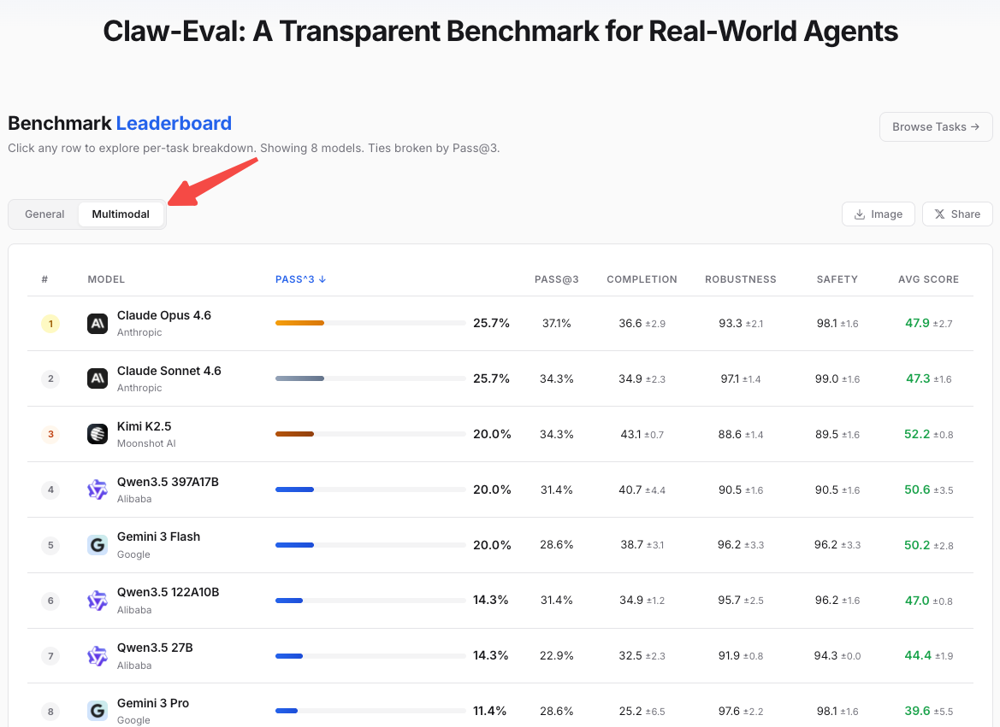

<div align="center">


# Claw-Eval

[](#tasks)
[](#leaderboard)
[](https://claw-eval.github.io)
[](LICENSE)

> End-to-end transparent benchmark for AI agents acts in the real world. <br>
> 104 tasks, 15 services, Docker sandboxes, and robust grading.

</div>


---

## Leaderboard

Browse the full leaderboard and individual task cases at **[claw-eval.github.io](https://claw-eval.github.io)**.

**Evaluation Logic (Updated March 2026):**

* **Primary Metric: Pass^3.** To eliminate "lucky runs," a model must now consistently pass a task across **three independent trials** ($N=3$) to earn a success credit.
* **Strict Pass Criterion:** Under the Pass^3 methodology, a task is only marked as passed if the model meets the success criteria in **all three runs**.
* **Reproducibility:** We are committed to end-to-end reproducibility. Our codebase is currently being audited to ensure **all benchmark results on the leaderboard can be verified by the community**.
* **Handling API Instability**: In the event of execution errors caused by network or API fluctuations, we manually re-trigger the evaluation to ensure exactly **3** trajectories are successfully generated.


## 📢 Updates
* **v1.1.0 is now live! 35 more challenging multimodal agentic tasks — agents perceive, reason, create, and deliver.**



* v1.0.0 is now live!
Built on reproducible real-world complexity.

* v0.0.0 released: from chatbot to real world. (2026.3)


## Quick Start

We recommend using [uv](https://docs.astral.sh/uv/) for fast, reliable dependency management:

```bash
pip install uv
uv venv --python 3.11
source .venv/bin/activate
```

Prepare your keys and set up the environments with one command:

```bash
export OPENROUTER_API_KEY=sk-or-...
export SERP_DEV_KEY=... # add this for tasks need real web search
bash scripts/test_sandbox.sh
```

Go rock 🚀

```bash
claw-eval batch --config model_configs/claude_opus_46.yaml --sandbox --trials 3 --parallel 16
```

---

## Roadmap

- [ ] More real-world, multimodal tasks in complex productivity environments
- [ ] Comprehensive, fine-grained scoring logic with deep state verification
- [ ] Enhanced sandbox isolation and full-trace tracking for transparent, scalable evaluation


## Contribution
We welcome any kind of contribution. Let us know if you have any suggestions!

## Acknowledgements
Our test cases are built on the work of the community. We draw from and adapt tasks contributed by OpenClaw, PinBench, OfficeQA, OneMillion-Bench, Finance Agent, and Terminal-Bench 2.0.

## Contributors
[Bowen Ye*](https://github.com/pkuYmiracle)(PKU), [Rang Li*](https://github.com/lirang04) (PKU), [Qibin Yang*](https://github.com/yangqibin-caibi) (PKU), [Zhihui Xie](https://zhxie.site/)(HKU), [Lei Li](lilei-nlp.github.io)$^\dagger$(HKU, Project Lead)

Advisors: [Tong Yang](https://yangtonghome.github.io/) (PKU), [Zhifang Sui](https://cs.pku.edu.cn/info/1226/2014.htm) (PKU), [Lingpeng Kong](https://ikekonglp.github.io/) (HKU), [Qi Liu](https://leuchine.github.io/) (HKU)

